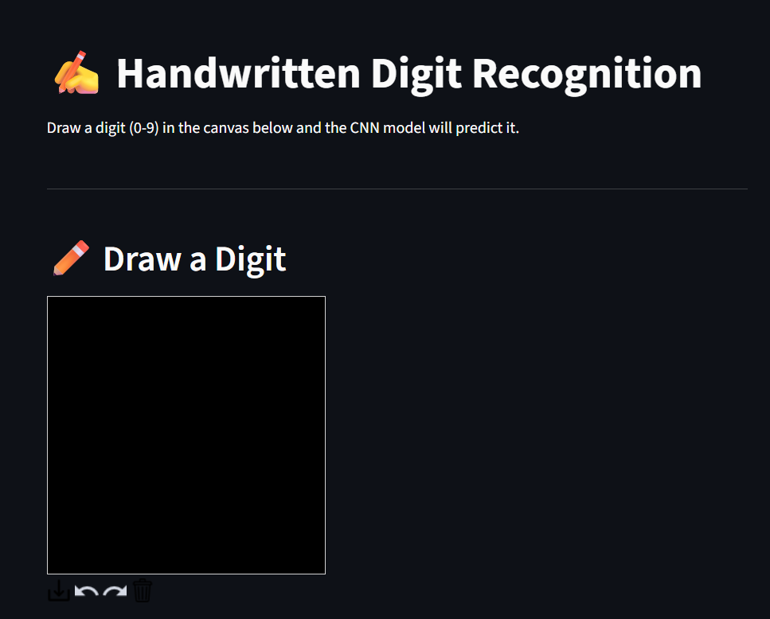
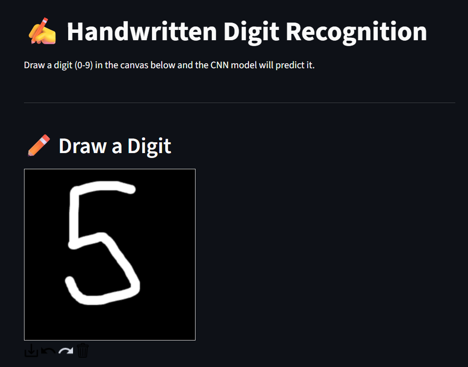
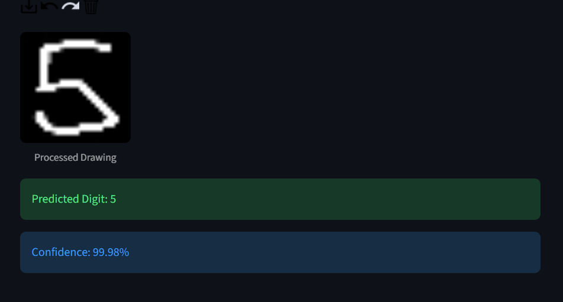

# 🧠 Handwritten Digit Recognition System

A Deep Learning-based Handwritten Digit Recognition application built using TensorFlow, Keras, OpenCV, and Streamlit.

The system allows users to draw handwritten digits on an interactive canvas and predicts the digit in real time using a Convolutional Neural Network (CNN) trained on the MNIST dataset.

---

## 🚀 Features

* CNN-based handwritten digit recognition
* Interactive drawing canvas
* Real-time digit prediction
* Confidence score display
* OpenCV image preprocessing
* Streamlit web application
* Trained on 70,000 handwritten digit images

---

## 📸 Application Demo

### Home Screen



### Digit Prediction



### Processed Drawing



---

## 🛠️ Tech Stack

* Python
* TensorFlow
* Keras
* OpenCV
* NumPy
* Streamlit
* Streamlit Drawable Canvas

---

## 📊 Dataset

MNIST Handwritten Digit Dataset

* 60,000 Training Images
* 10,000 Testing Images
* 10 Classes (0–9)
* Image Size: 28 × 28 Pixels

---

## 🧠 Model Architecture

CNN Architecture:

* Conv2D (32 Filters)
* MaxPooling2D
* Conv2D (64 Filters)
* MaxPooling2D
* Flatten Layer
* Dense Layer (128 Units)
* Dropout (0.3)
* Output Layer (10 Classes)

---

## 📈 Results

* Test Accuracy: 98–99%
* Real-Time Digit Prediction
* Confidence-Based Classification

---

## ⚙️ Installation

```bash
git clone https://github.com/harshitha121124/handwritten-digit-recognition.git

cd handwritten-digit-recognition

pip install -r requirements.txt

streamlit run app.py
```

---

## 📂 Repository Structure

```text
Handwritten-Digit-Recognition/

├── assets/
├── models/
├── data/
├── notebooks/

├── app.py
├── train_model.py
├── requirements.txt
└── README.md
```

---

## 🔮 Future Improvements

* Multi-digit recognition
* Support for uploaded handwritten images
* EMNIST alphabet recognition
* Mobile deployment
* Improved real-world handwriting support

---

## 👩‍💻 Author

**G. R. Harshitha**

B.Tech Mechanical Engineering
Indian Institute of Technology Madras

---

⭐ If you found this project useful, consider giving it a star.
